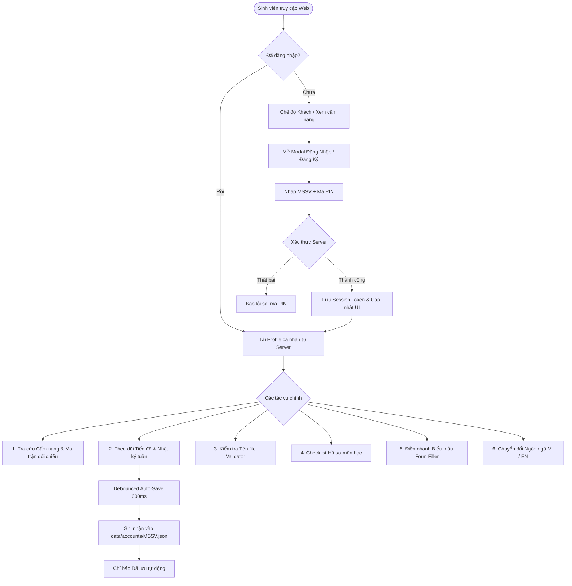
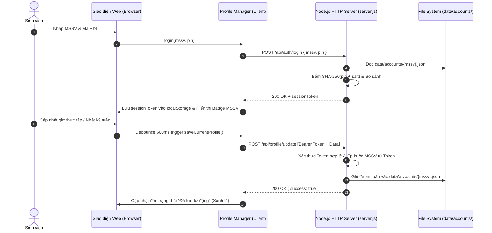

# CỔNG THÔNG TIN & QUẢN LÝ HỌC PHẦN THỰC TẬP TSNN & KTCN
> **Khoa Công Nghệ Thông Tin — Trường Đại học Tôn Đức Thắng (TDTU)**  
> Hệ thống cẩm nang học vụ tương tác, theo dõi tiến trình cá nhân và chuẩn hóa hồ sơ môn học (HSMH) dành cho sinh viên thực hiện học phần **Tập sự nghề nghiệp (TSNN)** và **Kiến tập công nghiệp (KTCN)**.

---

## MỤC LỤC
1. [Giới Thiệu Tổng Quan](#1-giới-thiệu-tổng-quan)
2. [Sơ Đồ Flow Làm Việc Của Web (Workflow Architecture)](#2-sơ-đồ-flow-làm-việc-của-web-workflow-architecture)
3. [Chi Tiết Các Tính Năng Đã Triển Khai](#3-chi-tiết-các-tính-năng-đã-triển-khai)
4. [Công Nghệ Sử Dụng & Kiến Trúc Kỹ Thuật](#4-công-nghệ-sử-dụng--kiến-trúc-kỹ-thuật)
5. [Cấu Trúc Thư Mục Dự Án](#5-cấu-trúc-thư-mục-dự-án)
6. [Hướng Dẫn Cài Đặt & Khởi Chạy](#6-hướng-dẫn-cài-đặt--khởi-chạy)
7. [Hệ Thống Kiểm Thử Tự Động (Test Suite)](#7-hệ-thống-kiểm-thử-tự-động-test-suite)

---

## 1. GIỚI THIỆU TỔNG QUAN

Học phần **Tập sự nghề nghiệp (TSNN)** và **Kiến tập công nghiệp (KTCN)** tại Khoa Công nghệ Thông tin - Trường Đại học Tôn Đức Thắng có nhiều quy định học vụ đặc thù, dễ gây nhầm lẫn dẫn đến việc sinh viên bị trả hồ sơ hoặc nhận điểm 0:
- Sự khác biệt về cổng phần mềm tác nghiệp (`tsnn.tdtu.edu.vn` vs `elearning.tdtu.edu.vn`).
- Yêu cầu mộc đỏ pháp nhân Doanh nghiệp (BM01, BM04) và phân biệt mộc vuông của Khoa vs mộc tròn của Trường.
- Khối lượng thời gian bắt buộc: **≥ 120H** cho 1 môn và **≥ 240H** khi học song hành cả 2 môn.
- Cú pháp đặt tên file đánh số nghiêm ngặt từ `1_MSSV_...` đến `6_MSSV_...`.
- Quy cách đóng cuốn bản cứng (bìa kiếng, cấm bìa mạ vàng) và video tổng kết (4-5 phút, ≤ 100MB, file MP4 nộp trực tiếp).

Hệ thống được xây dựng nhằm giải quyết toàn diện các khó khăn trên thông qua giao diện cẩm nang tương tác thời gian thực, tích hợp bộ công cụ cá nhân hóa và quản lý hồ sơ an toàn cho từng sinh viên.

---

## 2. SƠ ĐỒ FLOW LÀM VIỆC CỦA WEB (WORKFLOW ARCHITECTURE)

### 2.1. Luồng Người Dùng Tổng Thể (User Journey Flow)



### 2.2. Luồng Xử Lý Dữ Liệu & Xác Thực Bảo Mật (Security & Data Isolation Flow)



---

## 3. CHI TIẾT CÁC TÍNH NĂNG ĐÃ TRIỂN KHAI

### 3.1. Cẩm Nang Học Vụ & Ma Trận Đối Chiếu TDTU
- **KPI Metrics trực quan:** Hiển thị tức thì 4 chỉ số cốt tử: Khối lượng giờ (≥120H/240H), Khung thời gian (15 tuần TDTU), Phạm vi địa điểm (Linh hoạt IT), Đơn vị nội bộ TDTU.
- **Ma trận đối chiếu chi tiết:** Phân định rõ ràng từng tiêu chí giữa TSNN và KTCN:
  - Cổng phần mềm: `tsnn.tdtu.edu.vn` (Portal riêng) vs `elearning.tdtu.edu.vn` (Khóa học e-Learning).
  - Phê duyệt GVGS: Đánh giá trên web vs Báo cáo Google Form hằng tuần.
  - Biểu mẫu nộp: File xuất nhật ký web vs Bộ BM02 (ký mentor) & BM03.
  - Sử dụng chung BM01: TSNN nộp bản gốc mộc đỏ, KTCN nộp bản sao (nếu làm cùng đơn vị và đủ ≥240H).
- **Quy trình Thực tập sớm (Dự thảo TDTU):** 4 bước chuẩn hóa gồm BM08 trước kỳ, lưu trữ hồ sơ và điều kiện bắt buộc ĐKMH ở học kỳ liền kề tiếp theo.
- **3 Giai đoạn thực hiện:**
  - *GĐ1 (Chuẩn bị & Đăng ký):* Hướng dẫn Giấy giới thiệu (mộc vuông Khoa vs mộc tròn Trường), điều kiện mộc đỏ BM01, đăng ký cổng.
  - *GĐ2 (Trong 120H):* Nhật ký tác nghiệp, tương tác CBHD và GVGS.
  - *GĐ3 (Nộp HSMH):* 6 bước hoàn thiện gồm BM04 (cấm sửa rubric), Quyển báo cáo (≥40 trang, cấm bìa mạ vàng), Video (4-5 phút, ≤100MB, file MP4 trực tiếp), BM05 & BM06 (chỉ in form trắng), và quy cách kẹp hồ sơ 8 mục.
- **Bảng tra cứu Biểu mẫu BM01 – BM08:** Tra cứu nhanh yêu cầu con dấu, số lượng bản nộp, quy tắc đặc thù và link tải Google Drive.
- **Cẩm nang xử lý sự cố:** 3 tình huống thực tế về chậm mộc, lỗi cổng phần mềm và thẩm quyền mộc treo/chữ ký số.

---

### 3.2. Quản Lý Tài Khoản Sinh Viên Cá Nhân & Bảo Mật Dữ Liệu
- **Tài khoản độc lập theo MSSV:** Mỗi sinh viên sở hữu một tài khoản riêng gắn liền với Mã số sinh viên.
- **Bảo mật bằng mã PIN:** Đăng nhập và đăng ký bằng mã PIN 4-6 số. Mật khẩu được băm an toàn một chiều bằng thuật toán `SHA-256` kết hợp Salt trước khi lưu trữ.
- **Cách ly dữ liệu 100%:** Dữ liệu hồ sơ, thời gian biểu và nhật ký tuần được lưu tại file riêng biệt `data/accounts/{mssv}.json`. Không có tính năng chuyển đổi tài khoản công khai; sinh viên chỉ có thể xem và chỉnh sửa thông tin của chính mình.
- **Đồng bộ tự động ngầm (Debounced Auto-save):** Mọi thao tác chỉnh sửa (đổi tên, nhập công ty, thêm tuần làm việc, tích chọn ký) tự động lưu sau 600ms dừng gõ, không cần bấm nút "Lưu" thủ công.
- **Chỉ báo trạng thái trực quan:**
  - `Đang lưu...` (Đèn vàng nhấp nháy).
  - `Đã lưu tự động` (Đèn xanh lá).
  - `Lưu trên máy này` (Đèn xanh dương - khi chưa đăng nhập).

---

### 3.3. Thời Gian Biểu & Theo Dõi Tiến Độ Cá Nhân Hóa (Live Tracker)
- **Kiến trúc phân tách 2 học phần độc lập (Dual Track Architecture):**
  - Giải quyết bài toán thực tế khi sinh viên thực tập **Tập sự nghề nghiệp (TSNN)** và **Kiến tập công nghiệp (KTCN)** tại **hai doanh nghiệp/đơn vị khác nhau**.
  - Tách bạch thông tin nhập liệu thành 2 Track riêng biệt (Tab TSNN vs Tab KTCN): Mỗi môn có tên Công ty, Mã số thuế, Cán bộ hướng dẫn (Mentor), ngày bắt đầu/kết thúc và hạn nộp HSMH độc lập.
  - Tích hợp nút tiện ích: **"Sao chép thông tin DN từ môn kia"** (1-click sao chép nếu sinh viên thực tập cùng một công ty, không cần gõ lại).
  - Thanh tổng quan tiến độ kép: Hiển thị đồng thời tỉ lệ hoàn thành của từng môn (120H) và tổng khối lượng song hành (240H).
- **Nhật ký tuần dạng Accordion sổ xuống chi tiết theo từng ngày (Expandable Daily Logs):**
  - Mỗi tuần làm việc được thiết kế dạng **Accordion gập/mở (sổ xuống)** mượt mà với icon chevron xoay và huy hiệu số ngày.
  - Cho phép mở rộng để nhập chi tiết công việc cụ thể cho từng ngày: Thứ (T2 – T6/CN), Ngày tháng, Số giờ làm việc và Nội dung nhiệm vụ kỹ thuật chi tiết.
  - **Tự động cộng dồn giờ thông minh:** Khi điều chỉnh giờ làm việc của bất kỳ ngày nào, tổng số giờ của tuần và tổng tiến độ môn học sẽ tự động được tính toán lại ngay lập tức.
  - **Nút tiện ích "Điền nhanh T2-T6 (4H/ngày)":** Tự động điền 5 ngày làm việc chuẩn 20H chỉ với 1 cú click.
  - Nút thêm ngày linh hoạt (cho phép thêm Thứ 7 hoặc Chủ Nhật) và nút xóa ngày dễ dàng.
  - Checkbox xác nhận chữ ký của CBHD Doanh nghiệp (đối chiếu BM02).
- **Đếm ngược thời hạn (Deadline Countdown):** Tính toán số ngày còn lại đến hạn nộp bản cứng HSMH của Khoa, cảnh báo đổi màu đỏ khi quá hạn.
- **Thanh tiến độ & Vận tốc tích lũy:**
  - Tính toán phần trăm hoàn thành tổng thời gian theo môn và tổng thể.
  - Tính toán số giờ cần duy trì mỗi tuần (`requiredHoursPerWeek`) dựa trên ngày kết thúc dự kiến.
  - Cảnh báo tình trạng: Bình thường, Cần tăng tốc (Warning), hoặc Khẩn cấp (Urgent).
- **Sao chép báo cáo tiến độ chi tiết 1-Click:** Xuất bản tóm tắt tiến độ dạng văn bản có cấu trúc phân tầng (kèm chi tiết từng ngày của từng môn) vào Clipboard để báo cáo nhanh cho GVGS hoặc Mentor.

---

### 3.4. Bộ Công Cụ Hỗ Trợ Sinh Viên (Student Tools Modal)
1. **Kiểm tra tên file nộp HSMH (Validator):**
   - Kiểm tra định dạng tên file theo chuẩn: `{Thứ tự}_{MSSV}_{Tên biểu mẫu}.{ext}`.
   - Bắt các lỗi phổ biến: Chứa khoảng trắng, dùng tiếng Việt có dấu, nộp file Word (.docx) cho biểu mẫu thay vì scan PDF, video nộp sai định dạng (chỉ nhận `.mp4`, `.mov`, `.wmv`).
   - Thang điểm trực quan 0 - 100 kèm nút 1-click sửa tên file chuẩn đề xuất.
2. **Thời gian biểu & Nhật ký cá nhân:** Toàn bộ bảng điều khiển thời gian biểu và nhật ký tuần được tích hợp trong modal.
3. **Checklist hồ sơ cá nhân:**
   - 11 tiêu chí học vụ bắt buộc trước khi nộp hồ sơ.
   - Lưu trạng thái checkbox theo từng tài khoản, hiển thị tỉ lệ phần trăm hoàn thành.
4. **Điền nhanh biểu mẫu (Quick Form Filler):**
   - Nhập thông tin sinh viên (Họ tên, MSSV, Lớp) và doanh nghiệp (Tên công ty, MST, Mentor) một lần.
   - Nút sao chép trọn bộ thông tin chuẩn hóa để dán nhanh vào BM01, BM02 hoặc Google Form.

---

### 3.5. Hệ Thống Chuyển Đổi Song Ngữ (VI ↔ EN)
- Chuyển đổi mượt mà giữa **Tiếng Việt** và **Tiếng Anh** bằng nút bấm `VI` / `EN` trên thanh điều hướng.
- Sử dụng thuật toán `DOM TreeWalker` duyệt toàn bộ text node trên trang mà không làm hỏng cấu trúc HTML hoặc mất các icon Material Symbols.
- Từ điển hoàn chỉnh **589 mục từ** trong `language.json`, dịch đầy đủ cả tiêu đề, mô tả, các bảng ma trận, các bước giai đoạn và nội dung các modal.
- Dịch động cả các thuộc tính giao diện: `placeholder` thanh tìm kiếm, `title` trang web, `aria-label`.
- Khôi phục chính xác 100% bản gốc tiếng Việt khi người dùng chuyển lại `VI`.
- Ghi nhớ tùy chọn ngôn ngữ vào `localStorage` cho những lần truy cập sau.

---

### 3.6. Cấu Hình Học Kỳ Dành Cho Quản Trị (Admin Config Modal)
- Cho phép quản trị viên điều chỉnh nhanh tên học kỳ (VD: `HK2/2025-2026`).
- Tùy chỉnh hạn nộp GĐ1, GĐ2, GĐ3 và đường dẫn Google Drive kho biểu mẫu.
- Dữ liệu cấu hình được lưu trữ và có nút khôi phục mặc định an toàn.

---

## 4. CÔNG NGHỆ SỬ DỤNG & KIẾN TRÚC KỸ THUẬT

| Thành phần | Công nghệ / Kỹ thuật | Lý do lựa chọn & Mục đích |
| :--- | :--- | :--- |
| **Giao diện (Frontend)** | **Vanilla HTML5 + Tailwind CSS (Engine)** | Tối ưu tốc độ tải trang cực nhanh, không phụ thuộc nặng nề vào các framework cồng kềnh, dễ dàng bảo trì và tùy biến styling. |
| **Icons & Typography** | **Google Material Symbols, Be Vietnam Pro, JetBrains Mono, Space Grotesk** | Chuẩn nhận diện hình ảnh hiện đại, font chữ tiếng Việt hiển thị rõ nét, font monospace chuyên nghiệp cho tên file và code. |
| **Kiến trúc Client** | **Native ES Modules (JavaScript ES6+)** | Phân tách logic rõ ràng thành các module chuyên biệt (`validator`, `hoursTracker`, `personalTracker`, `profileManager`, `i18n`, `testRunner`) không cần qua bước bundling (Vite/Webpack) khi chạy trực tiếp. |
| **Bộ máy Song ngữ** | **DOM TreeWalker + JSON Dictionary** | Dịch trực tiếp trên DOM đang hiển thị, lưu vết text gốc để chuyển đổi qua lại mượt mà, hỗ trợ 589+ cụm từ. |
| **Máy chủ (Backend Server)** | **Node.js Built-in HTTP Server (`http`, `fs`, `path`, `crypto`)** | **Zero External Dependencies** (Không cần `npm install`, không phụ thuộc thư viện bên ngoài), hoạt động độc lập, nhẹ và bảo mật. |
| **Xác thực & Bảo mật** | **SHA-256 Hash + Salt & Bearer Session Tokens** | Mã hóa mã PIN an toàn, xác thực phiên đăng nhập bằng mã token ngẫu nhiên, chặn mọi hành vi can thiệp trái phép giữa các MSSV. |
| **Lưu trữ dữ liệu (Database)** | **Flat-file JSON Database (`data/accounts/{mssv}.json`)** | Lưu trữ độc lập cho từng sinh viên, dễ dàng backup, không cần cài đặt hệ quản trị cơ sở dữ liệu phức tạp. |
| **Kiểm thử tự động** | **In-browser Interactive Test Runner** | 10 test cases kiểm thử logic chạy trực tiếp trên cả Node.js CLI và giao diện Web. |

---

## 5. CẤU TRÚC THƯ MỤC DỰ ÁN

```text
INTERN-page-main/
│
├── index.html                    # Giao diện chính của ứng dụng
├── app.js                        # Controller chính điều phối các module và sự kiện
├── server.js                     # Node.js HTTP Server phục vụ API xác thực & file tĩnh
├── language.json                 # Từ điển song ngữ Anh - Việt (589 mục từ)
├── package.json                  # Cấu hình dự án
│
├── modules/                      # Các module nghiệp vụ (Native ES Modules)
│   ├── i18n.js                   # Bộ máy chuyển đổi đa ngôn ngữ (DOM TreeWalker)
│   ├── profileManager.js         # Quản lý tài khoản, phiên làm việc & đồng bộ REST API
│   ├── personalTracker.js        # Logic tính toán tiến độ cá nhân & nhật ký tuần
│   ├── hoursTracker.js           # Thuật toán tính toán số giờ thực tập (120H/240H)
│   ├── validator.js              # Thuật toán kiểm tra & chuẩn hóa cú pháp tên file
│   ├── checklist.js              # Dữ liệu danh mục 11 tiêu chí hồ sơ môn học
│   ├── formsData.js              # Dữ liệu quy tắc biểu mẫu BM01 - BM08
│   ├── adminConfig.js            # Quản lý cấu hình học kỳ & deadline các giai đoạn
│   └── testRunner.js             # Bộ 10 test cases kiểm thử tự động
│
├── data/                         # Thư mục lưu trữ dữ liệu (Database)
│   └── accounts/                 # Hồ sơ riêng biệt của từng sinh viên
│       ├── 52000888.json
│       └── 52200111.json
│
└── README.md                     # Tài liệu hướng dẫn chi tiết dự án
```

---

## 6. HƯỚNG DẪN CÀI ĐẶT & KHỞI CHẠY

Dự án được thiết kế với tiêu chí **Zero External Dependencies**, bạn chỉ cần cài đặt **Node.js (khuyến nghị v18+)** trên máy mà không cần cài thêm bất kỳ gói npm nào.

### Bước 1: Clone kho mã nguồn
```bash
git clone https://github.com/nhan1232004/TSNN.git
cd TSNN
```

### Bước 2: Khởi chạy máy chủ
Chạy lệnh trực tiếp bằng Node.js:
```bash
node server.js
```
*Máy chủ sẽ khởi động và lắng nghe tại:* `http://localhost:3000`

### Bước 3: Truy cập ứng dụng
Mở trình duyệt web bất kỳ và truy cập vào:
```text
http://localhost:3000
```

### Tài khoản mẫu thử nghiệm (Demo Accounts):
| MSSV | Mã PIN | Họ và tên sinh viên | Ghi chú |
| :--- | :--- | :--- | :--- |
| `52000888` | `1234` | Trần Hoàng Quốc Bảo | Tài khoản đã tích lũy 65/120H, có nhật ký 3 tuần |
| `52200111` | `5678` | Nguyễn Văn An | Tài khoản mới bắt đầu |

*Hoặc bạn có thể tự bấm **"Đăng Ký Mới"** trên giao diện với MSSV và mã PIN của chính mình.*

---

## 7. HỆ THỐNG KIỂM THỬ TỰ ĐỘNG (TEST SUITE)

Dự án tích hợp sẵn bộ kiểm thử 12 Test Cases bao quát toàn bộ logic cốt lõi.

### Chạy kiểm thử từ Command Line (CLI):
```bash
node -e "import('./modules/testRunner.js').then(m => m.executeAllTests(r => console.log(r.id, r.status, r.outputMessage)))"
```

### Danh sách 12 Test Cases:
1. `TC-VAL-01`: Kiểm tra tên file nộp HSMH chuẩn TDTU (`1_52000888_BM01.pdf`).
2. `TC-VAL-02`: Bắt lỗi tên file chứa khoảng trắng (`1_52000888 BM01.pdf`).
3. `TC-VAL-03`: Bắt lỗi file biểu mẫu không phải định dạng PDF scan màu (`1_52000888_BM01.docx`).
4. `TC-VAL-04`: Bắt lỗi file Video nộp sai định dạng (`6_52000888_VideoTSNN.zip`).
5. `TC-VAL-05`: Tự động sửa lỗi & đề xuất cú pháp tên file chuẩn TDTU.
6. `TC-HRS-01`: Tính toán giờ học phần đơn lẻ (Mục tiêu ≥ 120H).
7. `TC-HRS-02`: Tính toán giờ học phần song hành (Mục tiêu ≥ 240H, cảnh báo thiếu giờ).
8. `TC-TRACK-01`: Tính toán tiến trình cá nhân hóa từ nhật ký tuần thực tế.
9. `TC-TRACK-02`: Tính toán tổng giờ từ chi tiết các ngày trong tuần (Daily Logs).
10. `TC-TRACK-03`: Quản lý và phân tách 2 học phần độc lập (Dual Tracks: TSNN & KTCN).
11. `TC-UTIL-01`: Thuật toán chuẩn hóa loại bỏ dấu tiếng Việt cho tên file.
12. `TC-I18N-01`: Kiểm tra gói từ điển song ngữ Anh - Việt (610+ mục từ).

---

## BẢN QUYỀN & THÔNG TIN HỌC VỤ
- **Đơn vị phát triển:** Dự án phục vụ sinh viên Khoa Công nghệ Thông tin — Trường Đại học Tôn Đức Thắng.
- **Quy chuẩn đối chiếu:** Dựa trên Cẩm nang hướng dẫn học phần TSNN & KTCN chính thức của Khoa CNTT TDTU.
